1. What is the result of the following code?
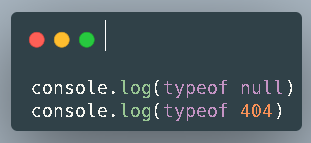
a. null & number
b. object & number
c. number & number
d. undefined & number

2. The difference between let  and const in Javascript is?
a. Value of  let  will be fixed, whereas value of const can be changed
b. We can create duplicate variable name using let, whereas const is cant
c. Let has weakness in terms of scope, whereas const is does not
d. Value of  const  will be fixed, whereas value of let can be changed

3. This code will be error if executed. What caused error?
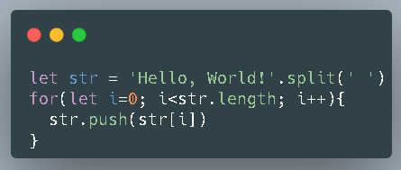
a. An infinite loop occurs because of `str.push(str[i])`
b. Incorrect syntax in the for loop
c. String in the var `str` cannot be directly given the `.split()` method
d. The condition step in the for loop cannot be `i += 1`

4. What the output when this code is executed?
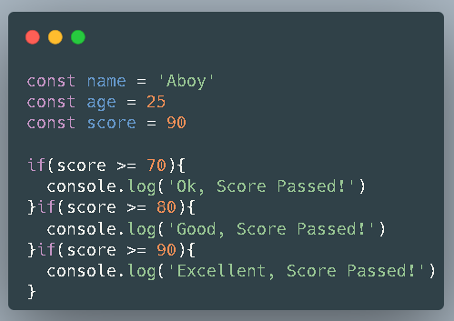
a. Ok, Score Passed
b. Good, Score Passed
c. Excellent, Score Passed
d. All Answer is Correct

5. The correct result from both console.log is?
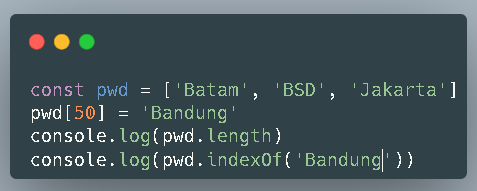
a. 51 & 51
b. 51 & 50
c. 50 & 51
d. 49 & 50

6. Which one the correct syntax of ternary operator?
a. 3 => 0? console.log(true) : console.log(false)
b. 100 < 0? true : false
c. 10 =10? console.log('Yes') : console.log('No')
d. "ABC" =! "abc"? return 1 : return 0

7. Result of console.log(point) is?
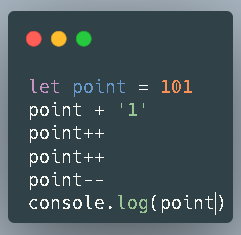
a. 102
b. 103
c. 1012
d. 1013

8. Result of two console.log bellow is?
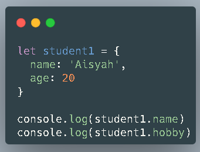
a. Aisyah & ReferenceError: property hobi is not defined
b. Aisyah & Undefined 
c. Aisyah & Null
d. Aisyah & NaN

9. What the result from following code?
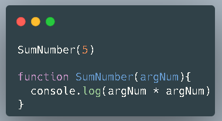
a. 25
b. Undefined
c. Error, because we call the function first before initiazion
d. Error, because the function not return anything

10. What the result from following code?
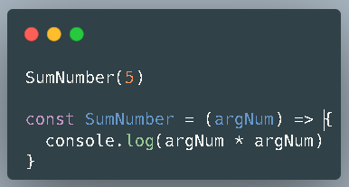
a. 25
b. Undefined
c. Error, because we call the function first before initiazion
d. Error, because the function not return anything

11. See the code bellow. The result of console.log is?

a. ['West Ham', 'Wolves', 'City', 'Chelsea', 'Arsenal']
b. ['United', 'West Ham', 'Wolves', 'City', 'Chelsea']
c. ['City', 'West Ham', 'Wolves', 'Chelsea', 'Arsenal']
d. ['United', 'City', 'West Ham', 'Wolves', 'Chelsea']

12. The result of both console.log is?
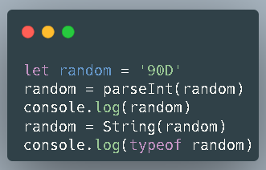
a. NaN & Object
b. 90 & Number
c. NaN & String 
d. 90 & String

13. The result of both console.log is?
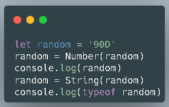
a. NaN & Object
b. 90 & Number
c. NaN & String 
d. 90 & String

14. Which one the correct syntax of variable declaration in Javascript?
a. let password = @abc123
b. const school_name = 'Purwadhika'
c. const Object = 'abc123'
d. const FirstName

15. How to access property of 'name' inside the array from this following code?
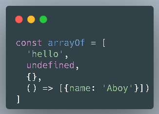
a. arrayOf[2]().name
b. arrayOf[3]()[0]['name']
c. arrayOf[2]['name']
d. arrayOf[3].name

16. Final result of variable number is?
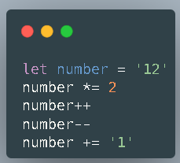
a. 251
b. 241
c. 25
d. 24
